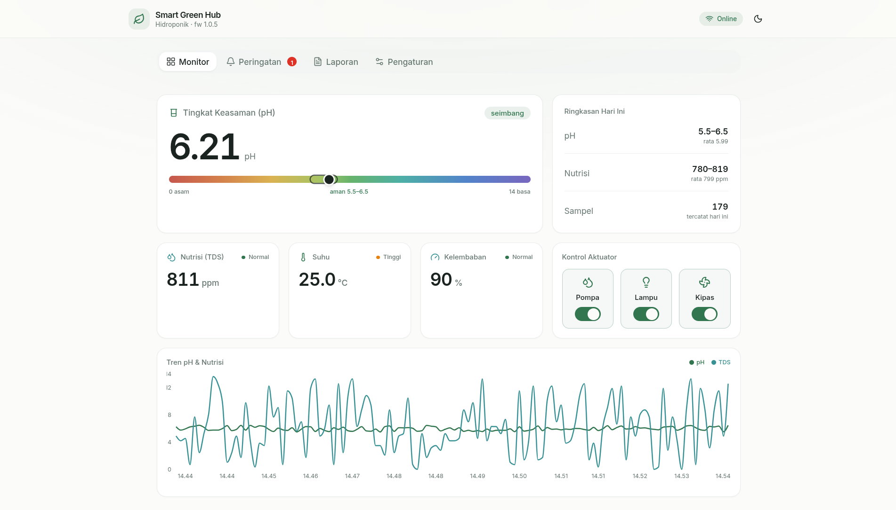
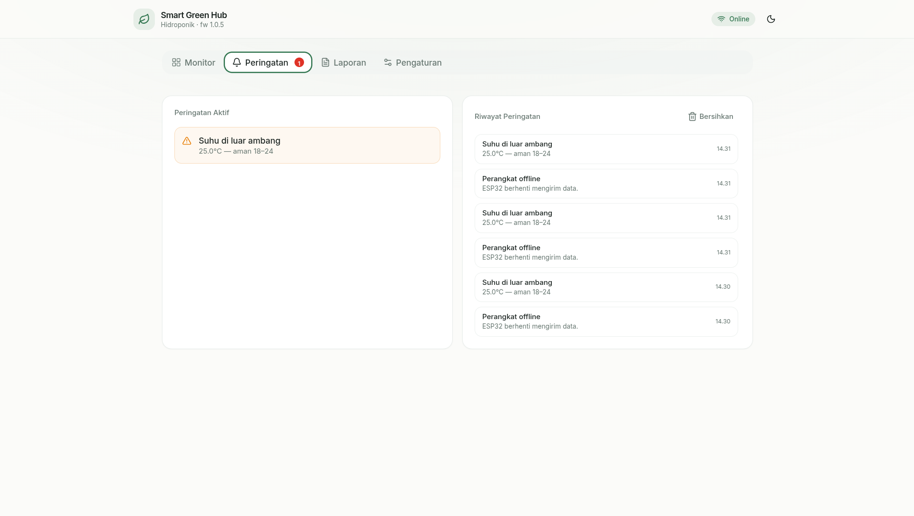
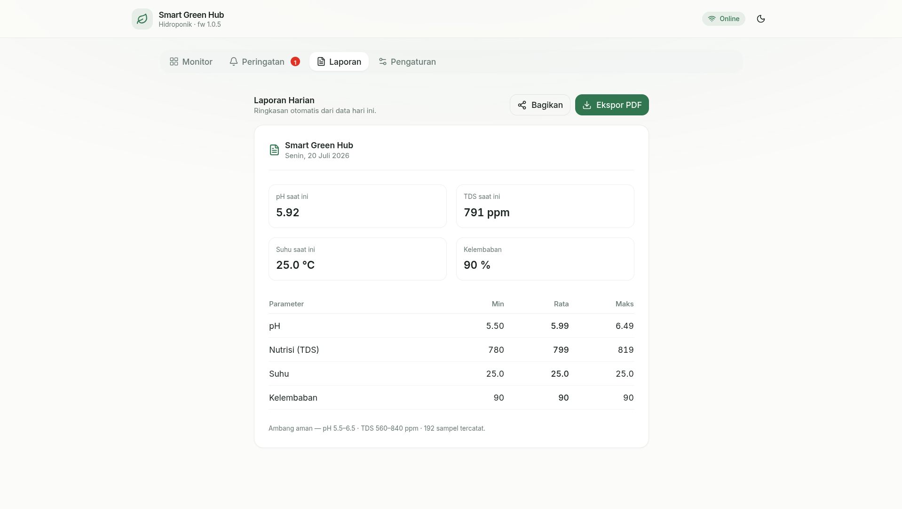
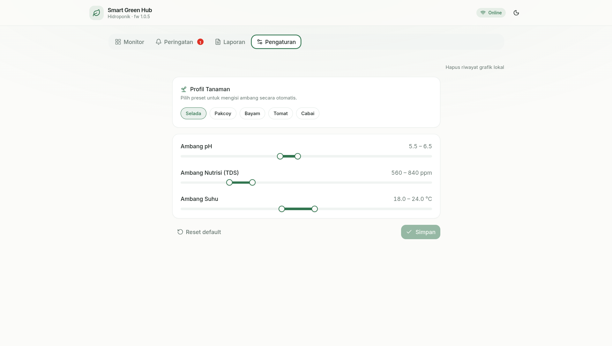
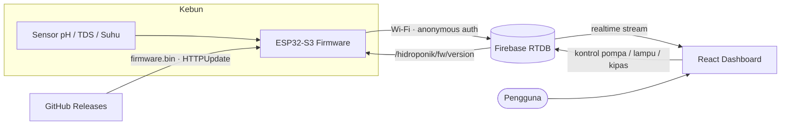

<p align="center">
  
</p>

<h1 align="center">Smart Green Hub</h1>

<p align="center">
  IoT hydroponics monitoring &amp; control — an ESP32-S3 firmware with cloud
  over-the-air updates, paired with a React dashboard on Firebase.
</p>

<p align="center">
  
</p>

## Overview

Smart Green Hub monitors and controls a hydroponic system. An **ESP32-S3** reads
sensor values (pH, nutrient/TDS, temperature, humidity), streams them to
**Firebase Realtime Database**, and listens for control commands. A separate
**React dashboard** reads the same database in realtime — showing live
readings, trends, and alerts, and letting you toggle the pump, lamp, and fan
from any browser.

The device never needs a public IP: it authenticates anonymously and both talks
to and listens on the cloud database. Firmware itself can be updated remotely —
the device pulls a new `firmware.bin` from **GitHub Releases** when a version
field in the database changes.

> The firmware currently ships simulated sensor values so the whole pipeline can
> be exercised end to end; swap `TaskHydroponicLogic` for real sensor reads when
> the probes are wired.

## Dashboard

<p align="center">
  
</p>

<table>
  <tr>
    <td width="50%"><br><sub><b>Peringatan Cerdas</b> — active alerts &amp; history</sub></td>
    <td width="50%"><br><sub><b>Laporan &amp; Ekspor</b> — daily summary, PDF, share</sub></td>
  </tr>
  <tr>
    <td width="50%"><br><sub><b>Pengaturan Ambang</b> — thresholds &amp; plant profiles</sub></td>
    <td width="50%"></td>
  </tr>
</table>

## Features

**Firmware (ESP32-S3)**

- Anonymous Firebase login — no per-device account to manage
- Realtime control stream: pump, lamp, and fan follow database changes
- 5-second heartbeat (`esp_status`, `last_ping`) so the dashboard knows it is alive
- Dual-core FreeRTOS: sensor logic on core 1, cloud sync on core 0
- **Three ways to flash**, from cable to fully remote:

  | Path | When | How |
  | --- | --- | --- |
  | USB cable | Recovery / first flash | PlatformIO **Upload** |
  | Wireless (same Wi-Fi) | Bench development | `env:wireless` → **Upload** (ArduinoOTA) |
  | Cloud OTA (any network) | Deployed in the field | GitHub Release + database trigger |

**Dashboard (React)**

- **Monitor** — live pH on a reagent-color scale, TDS/temp/humidity cards,
  actuator switches, a pH &amp; nutrient trend chart, and a daily summary
- **Peringatan** — smart alerts (abnormal pH, low/high nutrient, temperature,
  offline) with a rolling history
- **Laporan** — automatic daily summary with PDF export and share
- **Pengaturan** — adjustable pH / TDS / temperature thresholds and one-tap
  plant profiles (Selada, Pakcoy, Bayam, Tomat, Cabai)
- Responsive: bottom navigation on mobile, tabbed layout on desktop, light/dark

## Tech Stack

| Layer | Technology |
| --- | --- |
| Firmware | C++ · Arduino (pioarduino / ESP-IDF 5.x) · PlatformIO |
| Cloud | Firebase Realtime Database · Anonymous Auth |
| OTA delivery | GitHub Releases + `HTTPUpdate` |
| Dashboard | React · TypeScript · Vite · Tailwind CSS · Radix (shadcn-style) · Recharts |
| Hosting | Firebase Hosting |

## Architecture



Nothing connects to the device directly. Both the laptop and the ESP32 only talk
to the cloud, so updates and control work across any network.

## Repository Structure

```text
.
├── platformio.ini            # PlatformIO env (pioarduino platform, OTA partitions)
├── src/main.cpp              # ESP32-S3 firmware
├── include/
│   ├── secrets.h             # Wi-Fi + Firebase keys (gitignored)
│   └── secrets.h.example     # Template — copy to secrets.h
└── dashboard/                # React + Vite dashboard
    ├── src/
    │   ├── components/        # UI, tabs, charts
    │   ├── hooks/             # Firebase data, alerts, storage, theme
    │   └── lib/               # firebase, types, plant profiles, helpers
    ├── firebase.json          # Firebase Hosting config
    └── package.json
```

## Firmware — Getting Started

**Requirements:** [PlatformIO](https://platformio.org/) (VS Code extension or
CLI), a USB cable, and an ESP32-S3 board. The build platform and libraries are
declared in `platformio.ini` and fetched automatically.

1. Provide credentials:

   ```bash
   cp include/secrets.h.example include/secrets.h
   # edit include/secrets.h — Wi-Fi + Firebase Web API key + database URL
   ```

2. Build and flash over USB (first flash must be by cable):

   ```bash
   pio run --target upload
   pio device monitor          # watch it connect to Wi-Fi + Firebase
   ```

> This project targets an ESP32-S3 whose PSRAM is disabled; `platformio.ini`
> uses the **pioarduino** platform with `dio_qspi` flash. A genuine N16R8 module
> can use `qio_opi` instead.

## Firmware — Remote OTA Update

Once a device is deployed, update it without touching it:

1. Bump `FW_VERSION` in `src/main.cpp`, then `pio run`.
2. Create a **GitHub Release** tagged `v<version>` and attach the freshly built
   `firmware.bin` (`.pio/build/esp32-s3-devkitc-1/firmware.bin`).
3. Set `/hidroponik/fw/version` in the Realtime Database to the same `<version>`.

The device detects the change, downloads the binary from GitHub, flashes itself,
and reboots. Progress is reported to `/hidroponik/fw/status` and `fw/running`.

> `FW_VERSION`, the GitHub tag, and the database value must match, or the device
> will re-download in a loop.

## Dashboard — Getting Started

**Requirements:** [Node.js](https://nodejs.org/) 20+.

```bash
cd dashboard
npm install        # once, after cloning
npm run dev        # http://localhost:5173 — live reload
```

Build and deploy to Firebase Hosting:

```bash
npm run build                 # outputs dashboard/dist
npx firebase-tools login      # once
npx firebase-tools deploy     # → https://smart-green-hub.web.app
```

## Firebase Setup

- **Authentication** → enable the **Anonymous** provider (used by both device
  and dashboard).
- **Realtime Database** → rules are per-key and require `auth != null`. Any new
  key written by the device must be allowed in the rules, or the write is
  silently denied.

Data model under `/hidroponik`:

| Key | Type | Written by |
| --- | --- | --- |
| `ph`, `tds`, `temperature`, `humidity` | number | device |
| `pump`, `lamp`, `fan` | `"ON"` / `"OFF"` | device + dashboard |
| `esp_status`, `last_ping`, `updated_at` | string / number | device |
| `fw/running`, `fw/version`, `fw/status` | string | device + release trigger |

Thresholds, plant profiles, and the trend history are stored per-browser in
`localStorage` — no database or firmware changes required.

## Security Notes

- Wi-Fi and Firebase keys live in `include/secrets.h`, which is gitignored.
- The Firebase Web API key is public by design; the Realtime Database is guarded
  by rules, not by hiding the key.
- Anonymous auth is a thin gate. Before production, lock `fw/version` writes to a
  trusted UID so only you can trigger OTA updates.
- OTA downloads use HTTPS; certificate verification is currently relaxed
  (`setInsecure`) and can be hardened with an embedded root CA.

## License

Released under the [MIT License](LICENSE).
